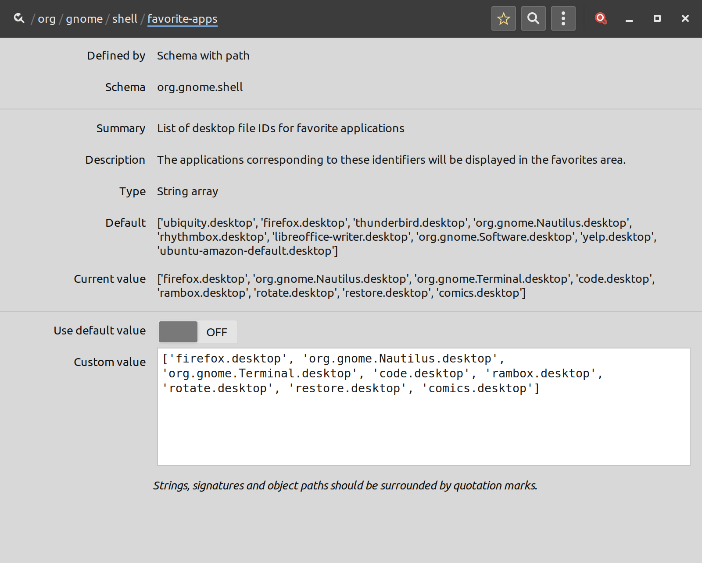

# comics-on-microsoft-surface-with-linux
Using Linux to read comicbooks on a Microsoft Surface sucks. Here's how to improve the experience

The Microsoft Surface is a nice piece of kit, and even runs Linux relatively well now. But reading comicbooks on it? There are a few problems to say the least:

* Automatic screen rotation doesn't always work. Since most comicbooks are in portrait format, this is not good
* Touch-friendly comicbook reader apps don't really exist

Here's how I've (partially) fixed things on my Ubuntu 18.04 system.

## Prerequisites

* Gnome (I'm using Gnome 3.28)
* Document Viewer (installed with Gnome by default)
* X11 (not Wayland)
* dconf-editor (can install from apt)

## Screen Rotation

For some reason, my Surface screen won't automatically rotate. If yours rotates just fine, you can skip this section.

If you're running X11 (i.e. not Wayland), you should have the *xrandr* program. From the command line you can run:

    xrandr --output eDP1 --rotate right
    xrandr --output eDP1 --rotate left
    xrandr --output eDP1 --rotate normal

to rotate your screen right, left, or back to normal. But naturally you don't want to muck about with the command line, so I created a couple of files you can add to your Gnome dock.

### Copy the files

Copy rotate.desktop and restore.desktop to .local/share/applications in your home directory:

    cp rotate.desktop restore.desktop ~/.local/share/applications

### Add to your dock

Since these desktop files just run a quick command (and not really a full-fledged program), you can't just add them to the dock the normal way:

#### Install *dconf-editor* from your terminal:

    sudo apt install dconf-editor

#### Edit the list of desktop file IDs

* Navigate to org/gnome/shell/favorite-apps
* Add 'restore.desktop' and 'remote.desktop' to the end of the Custom Value field. Ensure you have the quote marks and add commas between each value

## Opening Comic Files

I suggest the default Document Viewer in Gnome, since it supports .cbr and .cbz files, and is relatively touch-friendly.

You may want to set it to remove the page sidebar for a clearer view. It has an option to save the view mode to stop it popping up in future too.

## Organizing your Comic Files

I wrote a shell-script to move all comicbook files from my downloads folder into a comics folder, and then open a file manager window to show the comics folder. Be sure to edit it to fit your system!

* Edit the COMICDIR variable in move-comics.sh
* Copy move-comics.sh to /usr/local/bin
* Ensure the execute bit is set (chmod +x move-comics.sh)
* 